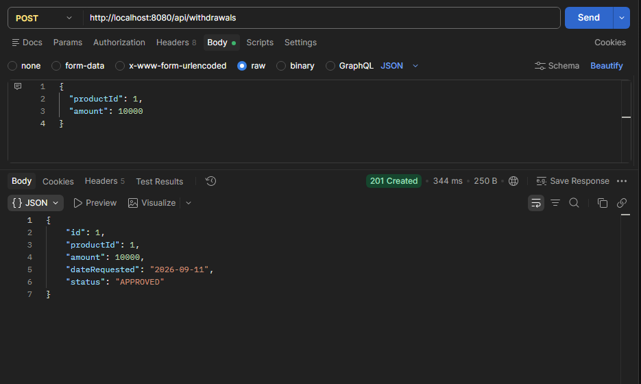
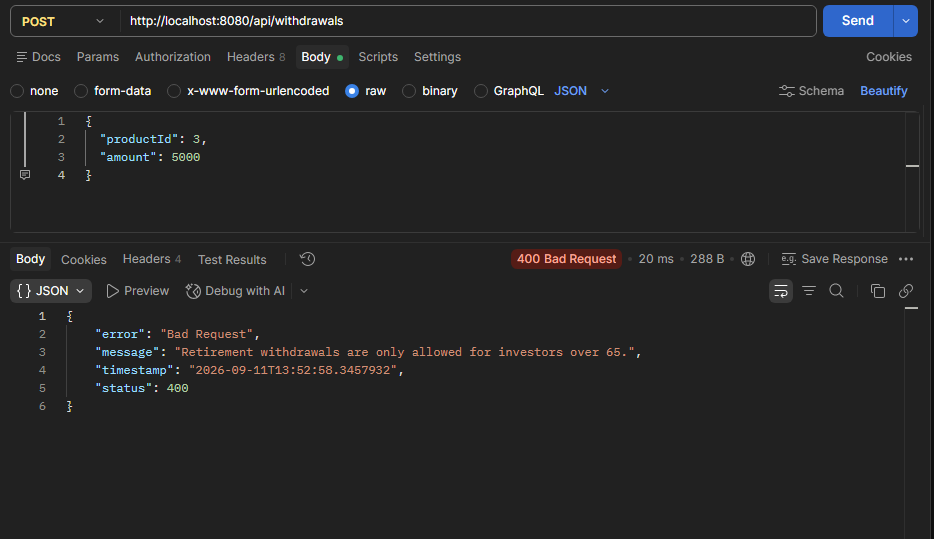
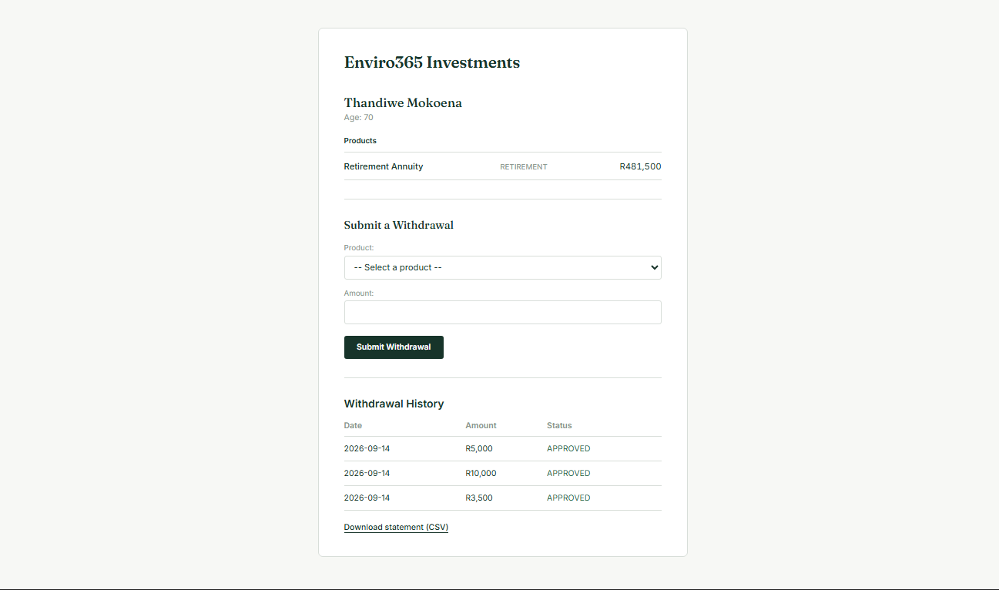
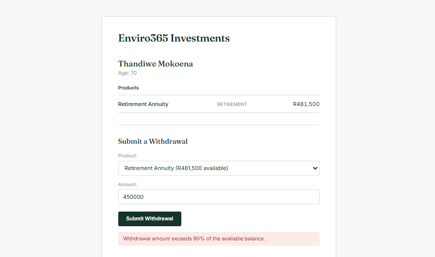
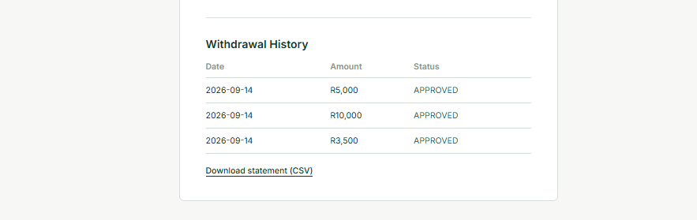
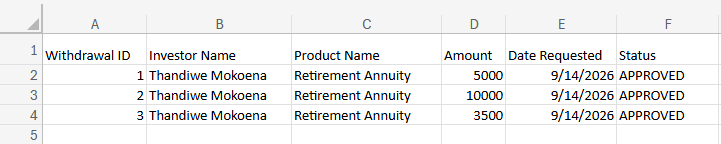

# Enviro365 Withdrawal Notice System

Full-stack system for Enviro365 Investments allowing investors to view portfolios,
submit withdrawal notices, and download statements. Built as part of the eTalente
Junior Software Developer assessment (2026).

## Tech Stack

- **Backend:** Java 21, Spring Boot 4.1.1, Spring Data JPA, H2 (in-memory)
- **Frontend:** React 18 (Vite), plain CSS
- **Testing:** JUnit 5, Mockito

## Project Structure

```enviro365/
├── backend/ # Spring Boot API
└── frontend/ # React UI
```
## Business Rules Implemented

- Retirement product withdrawals only allowed if investor age > 65
- Withdrawal amount cannot exceed the product's current balance
- Withdrawal amount cannot exceed 90% of the product's current balance

## Setup Instructions

### Backend
1. Requires Java 21+
2. Navigate to `backend/`
3. Run `./mvnw spring-boot:run`
4. App starts on `http://localhost:8080`
5. H2 in-memory database seeds automatically on startup with test data (2 investors, 3 products)
6. Run `./mvnw test` to execute the unit tests (5 tests covering WithdrawalService business rules)

### Frontend
1. Requires Node.js 18+
2. Navigate to `frontend/`
3. Run `npm install`
4. Run `npm run dev`
5. App runs on `http://localhost:5173`
6. Backend must be running on `http://localhost:8080` first (CORS is configured to allow only this frontend origin)

## API Documentation

### GET /api/investors/{id}
Returns an investor's portfolio (details + products).

**Example:** `GET /api/investors/1`

**Response `200 OK`:**
```json
{
  "id": 1,
  "name": "Thandiwe Mokoena",
  "age": 70,
  "products": [
    {
      "id": 1,
      "name": "Retirement Annuity",
      "type": "RETIREMENT",
      "balance": 500000
    }
  ]
}
```

### POST /api/withdrawals
Submits a withdrawal notice. Validates business rules before approving.

**Request body:**
```json
{
  "productId": 1,
  "amount": 10000
}
```

**Response `201 Created`** on success, with the created withdrawal notice.

**Business rule errors return `400 Bad Request`**, e.g.:
```json
{
  "timestamp": "2026-09-11T10:15:47.76",
  "status": 400,
  "error": "Bad Request",
  "message": "Retirement withdrawals are only allowed for investors over 65."
}
```

Validated rules:
- Retirement product withdrawals require investor age > 65
- Withdrawal amount cannot exceed the product's current balance
- Withdrawal amount cannot exceed 90% of the product's current balance
- `amount` must be a positive number (`@Positive` validation)

### GET /api/withdrawals/investor/{investorId}
Returns JSON withdrawal history for a single investor (used by the frontend's history table — separate from the CSV export, which returns plain text for download).

**Example:** `GET /api/withdrawals/investor/1`

**Response `200 OK`:** array of withdrawal notices, same shape as the `POST /api/withdrawals` response.

### GET /api/statements/export
Exports withdrawal history as a CSV file. All query parameters are optional and can be combined.

**Query parameters:**
- `investorId` (optional) — filter to a single investor
- `startDate` (optional, format `YYYY-MM-DD`) — only withdrawals on/after this date
- `endDate` (optional, format `YYYY-MM-DD`) — only withdrawals on/before this date

**Example:** `GET /api/statements/export?investorId=1&startDate=2026-01-01&endDate=2026-12-31`

**Response `200 OK`** — CSV file download (`Content-Disposition: attachment`):
```
Withdrawal ID,Investor Name,Product Name,Amount,Date Requested,Status
1,Thandiwe Mokoena,Retirement Annuity,10000.00,2026-09-11,APPROVED
```

## AI Usage Disclosure

This project was built with AI assistance (Claude, for planning/architecture/explanation,
and used to review and understand all generated code before committing). Key areas of
AI assistance so far:

- Entity relationship design (Investor → Product → WithdrawalNotice)
- JPA repository interface structure
- Business rule implementation in WithdrawalService
- Unit test structure using Mockito (mocking repositories, stubbing, verifying calls)
- DTO and mapper class structure to avoid exposing entities directly / circular JSON references
- React component structure and the "lift state up" pattern (App.jsx owning shared portfolio/withdrawal data, passed down to PortfolioDashboard, WithdrawalForm, WithdrawalHistoryTable as props)
- Frontend input validation in WithdrawalForm, alongside backend validation
- CORS configuration to allow the React dev server to call the Spring Boot API
- CSS design direction and styling

All AI-suggested code was reviewed, tested, and understood before being committed —
particularly the reasoning behind BigDecimal for currency, the exception hierarchy
design, and the mapper pattern for entity/DTO separation.

## Known Limitations / Assumptions

- Frontend is hardcoded to a single investor (id 1) — no login or investor selection, since the brief doesn't describe authentication. In a real system, the investor would come from a logged-in session.
- H2 is in-memory, so all data (including any withdrawals submitted) resets on every backend restart, aside from the seeded starter data.
- "Retirement" status lives on the Product, not the withdrawal request itself — a product is either a retirement product or not, rather than the user choosing a withdrawal type.
- CSV generation uses manual string building rather than a CSV library, since none of the exported fields contain commas or special characters that would need escaping.

## Screenshots

### Successful withdrawal (Postman)


### Age restriction rejection (Postman)


### Portfolio dashboard and withdrawal form


### Business rule rejection shown in UI (90% withdrawal limit)


### Withdrawal history table


### CSV export opened in Excel
